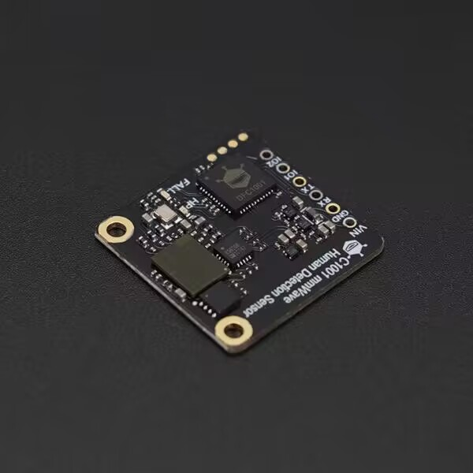

# DFRobot_HumanDetection

* [English Version](./README.md)
  
  这是一个人体毫米波的驱动库，可以实现呼吸睡眠、跌倒检测功能的检测。
  呼吸睡眠功能基于毫米波雷达体制实现人体生物存在感知及人体运动感知，持续记录人体存在情况，根据睡眠过程中的身体运动幅度变化和呼吸心率变化，对目标的睡眠状态、呼吸心跳频率进行实时判断，在一段睡眠过程结束后输出睡眠评分，根据相关睡眠参数的输出结合到健康康养的应用上。
  跌倒检测功能是基于人员姿态参数特征做算法判断，通过速度，距离，姿态等运动变化，测目标人员的跌倒状态，持续记录目标是否发生跌倒危险，同时针对长时间异常停留响应静止驻留报警。



## 产品链接 (https://www.dfrobot.com.cn/goods-3965.html)

    SKU: SEN0623

## 目录
  - [概述](#概述)
  - [库安装](#库安装)
  - [方法](#方法)
  - [兼容性](#兼容性)
  - [版本](#版本)
  - [创作者](#创作者)

## 概述
     这是一个人体毫米波的驱动库，可以实现呼吸睡眠、跌倒检测功能的检测。

## 库安装

使用此库前，请首先下载库文件，将其粘贴到\Arduino\libraries目录中，然后打开examples文件夹并在该文件夹中运行演示。
## 方法

```C++
  /**
     * @fn begin
     * @brief 初始化传感器
     * @return 返回初始化状态
     * @retval 0 初始化成功
     * @retval 1 初始化失败
    */
    uint8_t begin(void);

    /**
     * @fn configWorkMode
     * @brief 初始化模式
     * @param mode 模式选择
     * @return 返回初始化状态
     * @retval 0 模式配置成功
     * @retval 1 模式配置失败
    */
    uint8_t configWorkMode(eWorkMode mode);

    /**
     * @fn getWorkMode
     * @brief 获取工作模式
     * @return 返回工作模式
    */
    uint8_t getWorkMode(void);

    /**
     * @fn configLEDLight
     * @brief 配置LED灯
     * @param led 选择打开那个LED灯
     * @param sta 0:打开，1:关闭
     * @return 返回控制啊状态
     * @retval 0 配置成功
     * @retval 1 配置失败
    */
    uint8_t configLEDLight(eLed led, uint8_t sta);

    /**
     * @fn getLEDLightStatic
     * @brief 获取LED灯的状态
     * @param led LED灯选择
     * @return 返回灯状态
     * @retval 0 灯关闭
     * @retval 1 灯打开
    */
    uint8_t getLEDLightState(eLed led);

    /**
     * @fn sensorRet
     * @brief 复位传感器
     * @return 返回复位状态
     * @retval 0 复位成功
     * @retval 1 复位失败
    */
    uint8_t sensorRet(void);

    /**
     * @fn smHumanData
     * @brief 查询在睡眠模式下人体相关的内容
     * @param hm 获取数据内容选择
    */
    uint16_t smHumanData(esmHuman hm);

    /**
     * @fn getHeartRate
     * @brief 获取心率
     * @return 返回心率
    */
    uint8_t getHeartRate(void);

    /**
     * @fn getBreatheState
     * @brief 获取呼吸检测信息
     * @return 返回呼吸信息
     * @retval 1 正常
     * @retval 2 获取过快
     * @retval 3 获取过慢
     * @retval 4 无
    */
    uint8_t getBreatheState(void);

    /**
     * @fn getBreatheValue
     * @brief 获取呼吸数值
     * @return 返回呼吸数值
    */
    uint8_t getBreatheValue(void);

    /**
     * @fn getSleepSwitch
     * @brief 获取睡眠相关数据
     * @param sl 需要获取的数据
     * @return 返回获取的数据
    */
    uint16_t smSleepData(eSmSleep sl);

    /**
     * @fn getSleepComposite
     * @brief 睡眠综合状态查询
     * @return 返回综合查询数据
    */
    sSleepComposite getSleepComposite(void);

    /**
     * @fn getSleepStatistics
     * @brief 睡眠统计状态查询
     * @return 返回睡眠统计数据
    */
    sSleepStatistics getSleepStatistics(void);

    /**
     * @fn configSleep
     * @brief 配置睡眠模式功能
     * @param sl 功能选择
     * @param data 配置数据
     * @return 返回设置状态
    */
    uint8_t configSleep(eSmSleepConfig sl,uint8_t data);

    /**
     * @fn installAngle
     * @brief 用于跌倒模式中雷达角度安装设置
     * @param x x 角度
     * @param y y 角度
     * @param z z 角度
    */
    void dmInstallAngle(int16_t x, int16_t y, int16_t z);

    /**
     * @fn dmGetInstallAngle
     * @brief 获取雷达安装角度
     * @param x x 角度
     * @param y y 角度
     * @param z z 角度
    */
    void dmGetInstallAngle(int16_t *x, int16_t *y, int16_t *z);

    /**
     * @fn dmInstallHeight
     * @brief 设置雷达安装高度
     * @param he 安装高度
    */
    void dmInstallHeight(uint16_t he);

    /**
     * @fn dmGetInstallHeight
     * @brief 获取安装高度
     * @return 返回获取的安装高度
    */
    uint16_t dmGetInstallHeight(void);

    /**
     * @fn autoMeasureHeight
     * @brief 获取自动测高数据
     * @return 返回自动测高数据
    */
    uint16_t dmAutoMeasureHeight(void);

    /**
     * @fn dmHumanData
     * @brief 在跌倒模式下获取人体相关数据
    */
    uint16_t dmHumanData(eDmHuman dh);
    
    /**
     * @fn track
     * @brief 轨迹点查询
     * @param x x 坐标
     * @param y y 坐标
    */
    void track(uint16_t *x, uint16_t *y);

    /**
     * @fn trackFrequency
     * @brief 获取轨迹点上报频率
     * @return 返回轨迹点上报频率
    */
    uint32_t trackFrequency(void);

    /**
     * @fn unmannedTime
     * @brief 无人时间查询
    */
    uint32_t unmannedTime(void);


    /**
     * @fn getFallData
     * @brief 获取跌倒检测功能数据
     * @param dm 数据选择
     * @return 返回获取的数据
    */
    uint16_t getFallData(eDmFall dm);

    /**
     * @fn getFallTime
     * @brief 获取跌倒时长
     * @return 返回跌倒时长
    */
    uint32_t getFallTime(void);

    /**
     * @fn staticResidencyTime
     * @brief 驻留时长查询
     * @return 返回驻留时长
    */
    uint32_t staticResidencyTime(void);

    
    /**
     * @fn accumulatedHeightDuration
     * @brief 高度累计时间查询
     * @return 返回高度累计时间数据
    */
    uint32_t accumulatedHeightDuration(void);

    /**
     * @fn dmHumanConfig
     * @brief 配置跌倒模式下人体配置
     * @param con 配置选择
     * @param da 配置数据
     * @return 返回配置状态
     * @retval 1 配置失败
     * @retval 0 配置成功
    */
    uint8_t dmHumanConfig(eDmHumanConfig con,uint16_t data);

    /**
     * @fn unattendedTimeConfig
     * @brief 设置在跌倒模式下无人时间查询
     * @brief time 设置时间
     * @return 返回设置状态
     * @retval 0 成功
     * @retval 1 失败
    */
    uint8_t unattendedTimeConfig(uint32_t time);
    /**
     * @fn dmFallConfig
     * @brief 跌倒模式配置
     * @param con 配置选项
     * @param data 配置数据
     * @return 返回配置状态
     * @retval 0 成功
     * @retval 1 失败
     * 
    */
    uint8_t dmFallConfig(eDmFallConfig con, uint32_t data);
```

## 兼容性

MCU                | Work Well    | Work Wrong   | Untested    | Remarks
------------------ | :----------: | :----------: | :---------: | -----
Mega2560           |      √       |              |             | 
Leonardo           |      √       |              |             | 
ESP32              |      √       |              |             | 

## 版本

- 2024/6/3 - V1.0.0版本

## 创作者

Written by TangJie (jie.tang@dfrobot.com), 2019. (Welcome to our [website](https://www.dfrobot.com/))


