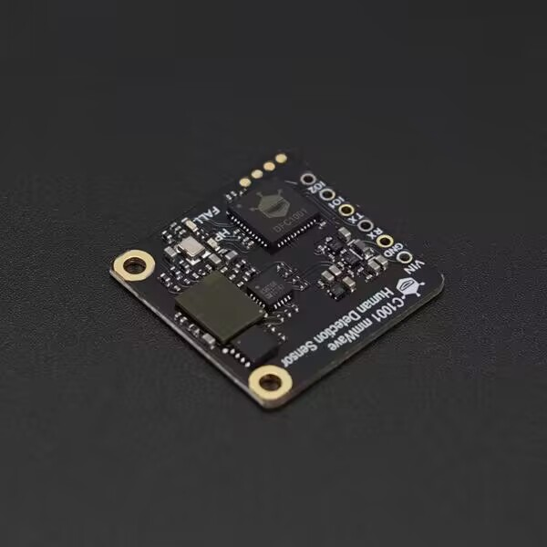

DFRobot_HumanDetection
===========================

* [中文版本](./README_CN.md)

This is a millimeter-wave human detection driver library that can detect breathing, sleep, and fall detection functions. 
The breathing sleep function is based on millimeter-wave radar system to realize human biological presence and human movement perception. It continuously records human presence, and based on changes in body movement amplitude and respiratory heart rate during sleep, it makes real-time judgments on the target's sleep state, respiratory and heart rate frequency. After a period of sleep, it outputs a sleep score, which can be used in health and wellness applications combined with the output of relevant sleep parameters.
The fall detection function is based on personnel posture parameter characteristics to make algorithm judgments, measuring the target person's fall state through changes in speed, distance, and posture. It continuously records whether the target is at risk of falling, and responds with a stillness alarm for long periods of abnormal inactivity.



## Product Link (https://www.dfrobot.com/product-2861.html)

    SKU: SEN0623

## Table of Contents

  * [Overview](#overview)
  * [Library Installation](#library-installation)
  * [Methods](#methods)
  * [Compatibility](#compatibility)
  * [History](#history)
  * [Credits](#credits)

## Overview

This is a millimeter-wave human detection driver library that can detect breathing, sleep, and fall detection functions.

## Library Installation

To use this library, first download the library to your Raspberry Pi, then open the examples folder. To run an example like demox.py, enter python demox.py in the command line. For example, to run the basics.py example, you need to enter:

```python
python basics.py

```

## Methods

```python
    def begin(self):
        '''!
            @fn begin
            @brief Initialize the sensor
            @return Initialization status
            @retval 0 Initialization successful
            @retval 1 Initialization failed
        '''
    
    def config_work_mode(self, mode):
        '''!
            @fn config_work_mode
            @brief Initialize mode
            @param mode Mode selection
            @return Initialization status
            @retval 0 Mode configuration successful
            @retval 1 Mode configuration failed
        '''
    
    def get_workmode(self):
        '''!
            @fn get_workmode
            @brief Get work mode
            @return Current work mode
        '''
    
    def config_LED_light(self, led, sta):
        '''!
            @fn config_LED_light
            @brief Configure the LED light
            @param led Choose which LED light to turn on
            @param sta 0: On, 1: Off
            @return Control status
            @retval 0 Configuration successful
            @retval 1 Configuration failed
        '''
    
    def get_LED_light_state(self, led):
        '''!
            @fn get_LED_light_state
            @brief Get the state of the LED light
            @param led LED light selection
            @return Light status
            @retval 0 Light off
            @retval 1 Light on
        '''
    
    def sensor_ret(self):
        '''!
            @fn sensor_ret
            @brief Reset the sensor
            @return Reset status
            @retval 0 Reset successful
            @retval 1 Reset failed
        '''

    def sm_human_data(self, hm):
        '''!
            @fn sm_human_data
            @brief Query human-related data in sleep mode
            @param hm Data selection
        '''

    def get_heart_rate(self):
        '''!
            @fn get_heart_rate
            @brief Get heart rate
            @return Heart rate
        '''

    def get_breathe_state(self):
        '''!
            @fn getBreatheState
            @brief Get breathing detection information
            @return Breathing information
            @retval 1 Normal
            @retval 2 Too fast
            @retval 3 Too slow
            @retval 4 None
        '''

    def get_breathe_value(self):
        '''!
            @fn getBreatheValue
            @brief Get breathing values
            @return Breathing values
        '''

    def sm_sleep_data(self, sl):
        '''!
            @fn sm_sleep_data
            @brief Get sleep-related data
            @param sl Data to be retrieved
            @return Retrieved data
        '''

    def config_sleep(self, sl, data):
        '''!
            @fn config_sleep
            @brief Configure sleep mode function
            @param sl Function selection
            @param data Configuration data
            @return Setting status
        '''
    
    def dm_install_angle(self, x, y, z):
        '''!
            @fn dm_install_angle
            @brief Set radar angle installation in fall mode
            @param x X angle
            @param y Y angle
            @param z Z angle
        '''

    def dm_get_install_angle(self):
        '''!
            @fn dm_get_install_angle
            @brief Get radar installation angle
            @return Radar installation angles
        '''
    
    def dm_install_height(self, he):
        '''!
            @fn dm_install_height
            @brief Set radar installation height
            @param he Installation height
        '''

    def dm_getInstall_height(self):
        '''!
            @fn dm_getInstall_height
            @brief Get installation height
            @return Installation height
        '''
    
    def dm_auto_measure_height(self):
        '''!
            @fn autoMeasureHeight
            @brief Get auto height measurement data
            @return Auto height measurement data
        '''
    
    def dm_humanData(self, dh):
        '''!
            @fn dmHumanData
            @brief Get human-related data in fall mode
            @return Retrieved data
        '''

    def track(self):
        '''!
            @fn track
            @brief Track coordinates
            @param x X coordinate
            @param y Y coordinate
        '''
    
    def track_frequency(self):
        '''!
            @fn trackFrequency
            @brief Get track point reporting frequency
            @return Reporting frequency
        '''
    
    def unmannedTime(self):
        '''!
            @fn unmannedTime
            @brief Query unmanned time
        '''

    def getFall_data(self, dm):
        '''!
            @fn getFallData
            @brief Get fall detection function data
            @param dm Data selection
            @return Retrieved data
        '''
    
    def get_fall_time(self):
        '''!
            @fn getFallTime
            @brief Get fall duration
            @return Fall duration
        '''
    
    def static_residency_time(self):
        '''!
            @fn staticResidencyTime
            @brief Query residency time
            @return Residency time
        '''
        
    def accumulated_height_duration(self):
        '''!
            @fn accumulatedHeightDuration
            @brief Query accumulated height duration
            @return Accumulated height duration data
        '''
    
    def dm_human_config(self, con, data):
        '''!
            @fn dmHumanConfig
            @brief Configure human settings in fall mode
            @param con Configuration selection
            @param data Configuration data
            @return Configuration status
            @retval 1 Configuration failed
            @retval 0 Configuration successful
        '''

    def unattended_time_config(self, time):
        '''!
            @fn unattendedTimeConfig
            @brief Set unattended time query in fall mode
            @param time Set time
            @return Setting status
            @retval 0 Successful
            @retval 1 Failed
        '''
    
    def dm_fall_config(self, con, data):
        '''!
            @fn dmFallConfig
            @brief Fall mode configuration
            @param con Configuration option
            @param data Configuration data
            @return Configuration status
            @retval 0 Successful
            @retval 1 Failed
        '''

```

## Compatibility

* RaspberryPi Version

| Board        | Work Well | Work Wrong | Untested | Remarks |
| ------------ | :-------: | :--------: | :------: | ------- |
| RaspberryPi2 |           |            |    √     |         |
| RaspberryPi3 |     √     |            |          |         |
| RaspberryPi4 |           |            |     √    |         |

* Python Version

| Python  | Work Well | Work Wrong | Untested | Remarks |
| ------- | :-------: | :--------: | :------: | ------- |
| Python2 |     √     |            |          |         |
| Python3 |     √     |            |          |         |

## History

- 2024-06-3 - Version 1.0.0

## Credits

Written by TangJie(jie.tang@dfrobot.com), 2021. (Welcome to our [website](https://www.dfrobot.com/))